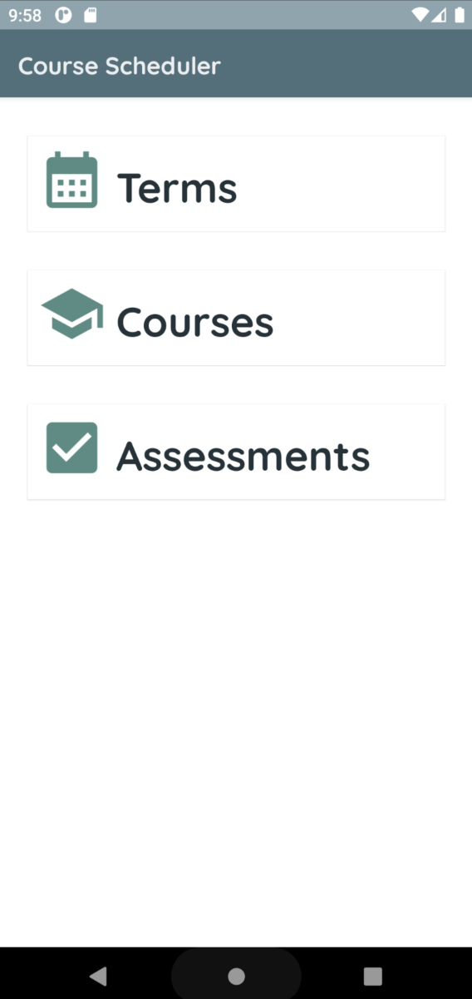
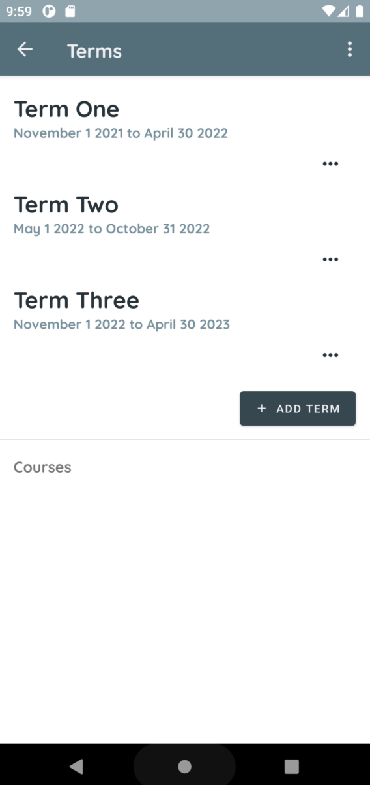
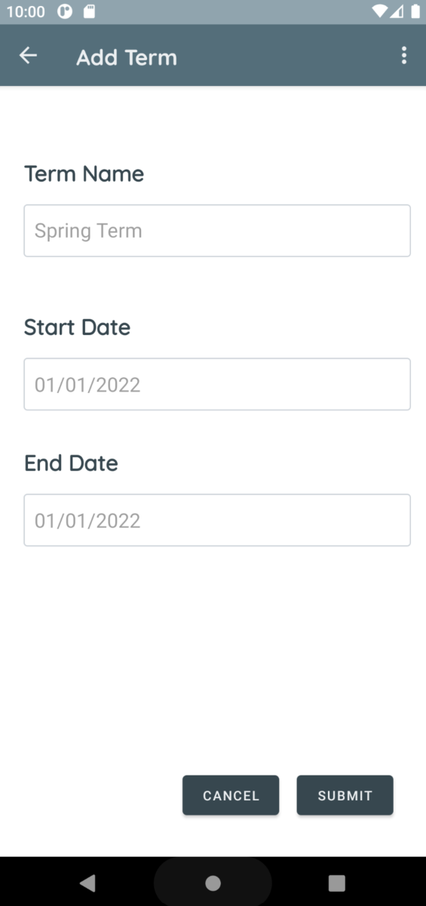
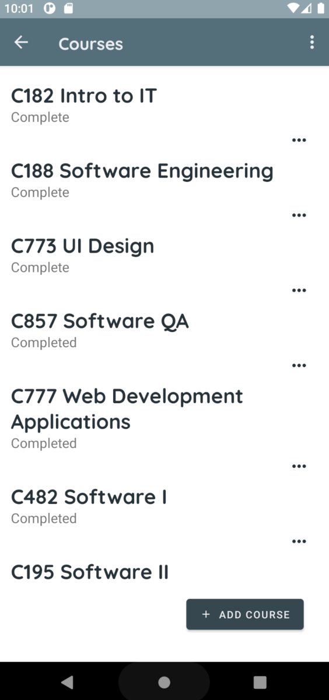
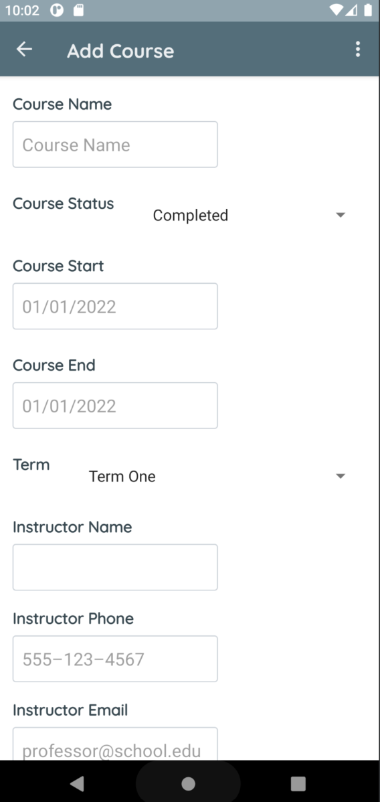
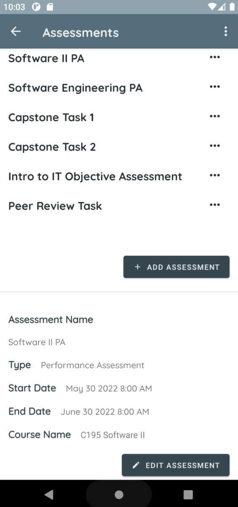
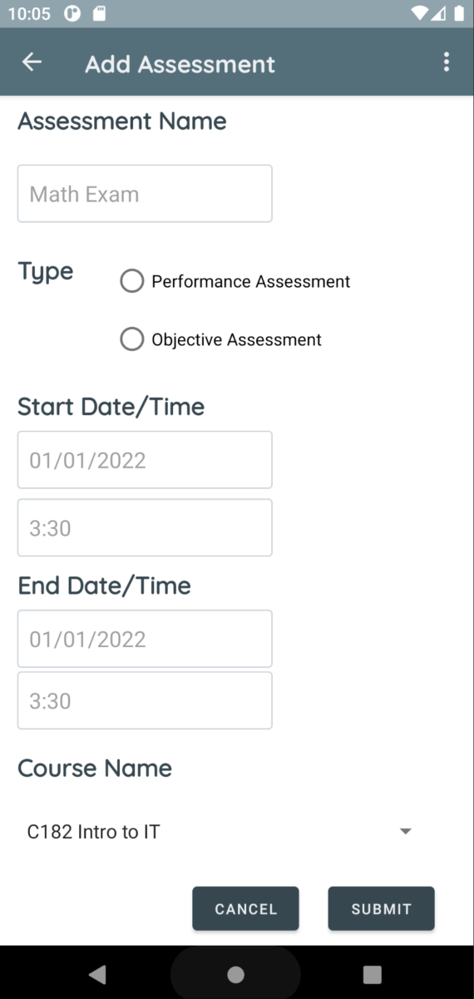

# Course Scheduler
Course and assessment manager for Android - Created for Mobile Application Development Course

## About the App
This Android app allows students to keep track of terms, courses, and assessments while they're in school. Add one or more terms with dates, and then add your courses and each course's assessments. After adding any of these, you can choose to add notifications as well. 

## User Interface

### Main Screen

### Term Screens

### Course Screens

### Assessment Screens

